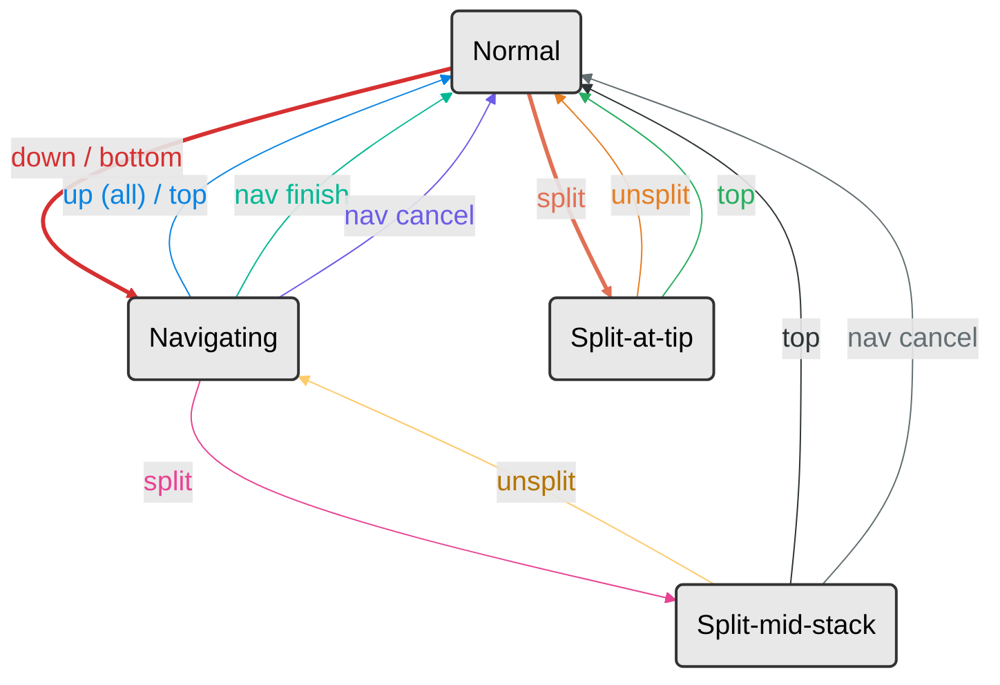

# ADR 0001: Navigation and Stack-Editing State Machine

## Status

Accepted

## Context

Jaspr provides commands for navigating mid-stack (`down`, `bottom`, `up`, `top`) and
editing commits in place (`split`, `unsplit`, `fold`, `drop`). These commands interact
with each other: splitting a commit while navigating mid-stack must update the navigation
bookkeeping, and certain command combinations would produce confusing or destructive
results if allowed.

We need a clear model of what states the tool can be in, which commands are legal in each
state, and how transitions between states work. Without this, adding new commands or
changing existing ones risks introducing incoherent state combinations.

## Decision

### Two orthogonal state axes

The tool tracks two independent pieces of ephemeral state, each persisted as a JSON file
under `.git/jaspr/`:

| Axis | File | Purpose |
|------|------|---------|
| **Navigation** | `nav-state.json` | Tracks a detached-HEAD session: the original branch, the full stack, and the cursor position. |
| **Splitting** | `split-state.json` | Tracks an in-progress split: the SHA of the commit that was reset, so `unsplit` can restore it. |

These two axes combine into four possible states:

| | Not Splitting | Splitting |
|---|---|---|
| **Not Navigating** | **Normal** | **Split-at-tip** |
| **Navigating** | **Navigating** | **Split-mid-stack** |

There are no other states. `fold`, `drop`, and other editing commands are one-shot
mutations that modify the stack (and update nav state if present) but do not introduce
new persistent state.

### State diagram

### Command eligibility by state

Commands fall into three categories: always available, state-dependent, and one-shot
mutations that are available whenever their preconditions are met.

| Command | Normal | Navigating | Split-at-tip | Split-mid-stack |
|---------|--------|------------|--------------|-----------------|
| `down [N]` | starts nav session | moves cursor down | BLOCKED | BLOCKED |
| `bottom` | starts nav session | moves cursor to 0 | BLOCKED | BLOCKED |
| `up [N]` | BLOCKED (no session) | replays N commits | BLOCKED | BLOCKED |
| `top` | BLOCKED (no session) | replays all, ends session | clears split | clears split, replays all, ends session |
| `split` | splits HEAD | splits commit at cursor | BLOCKED (already splitting) | BLOCKED (already splitting) |
| `unsplit` | BLOCKED (no split) | BLOCKED (no split) | restores commit | restores commit into nav stack |
| `fold down` | squashes into parent | squashes at cursor | BLOCKED | BLOCKED |
| `fold up` | BLOCKED (no session) | squashes commit above | BLOCKED | BLOCKED |
| `drop [N]` | removes N from top | removes N from top of nav stack | BLOCKED | BLOCKED |
| `nav cancel` | no-op (no session) | restores original branch | BLOCKED | hard escape: reset + clean |
| `nav finish` | no-op (no session) | ends session, discards above cursor | BLOCKED | BLOCKED |

### Why split blocks navigation

While a split is in progress, the user has uncommitted work in the index and working tree
that represents pieces of the original commit. Moving the nav cursor would require
cherry-picking commits on top of this partial state, which would either fail with
conflicts or silently incorporate unrelated changes. Blocking navigation avoids this
entire class of problems.

The three escape hatches from a split are:

- **`unsplit`**: Absorb everything back into the original commit (undo the split).
- **`top`**: Accept the current state (new commits the user created from the split pieces)
  and replay the remaining stack on top. This is the "done splitting" exit.
- **`nav cancel`**: Hard escape that resets to the original branch and clears all state.
  Destructive by design.

### Why `top` clears split state

`top` is the natural "I'm done, take me home" command. During a mid-stack split, the user
has broken a commit into pieces and created new commits. `top` replays the remaining
commits above the cursor onto whatever is there now, then restores the branch. Clearing
split state is part of this "session over" semantic.

### Stale navigation state

If the user manually runs `git checkout <branch>` while a nav session is active, HEAD
moves to a branch but `nav-state.json` still exists. This is detected by checking whether
HEAD is detached when nav state is present. Note that `git branch <name>` (without
checkout) is safe since it does not move HEAD.

When a session begins (`down` / `bottom`), jaspr installs a delimited block in
`.git/hooks/post-checkout` that warns the user immediately if a checkout invalidates the
session. The block is removed when the session ends. The hook coexists with any existing
post-checkout hook the user may have, by appending below it with markers.

The hook only prints; it does not modify nav state. That keeps the abandoned session
recoverable: if the user finds their way back to the prior detached HEAD (typically via
`git reflog` or `git checkout HEAD@{1}`), the saved cursor and stack are still valid and
navigation continues from where it left off.

Even with the hook, lazy detection still has to handle the case where the hook didn't run
or wasn't installed (e.g., older nav sessions started before this feature). `down` and
`bottom` continue to warn and start a fresh session if they find stale state.

### No nested splitting

Splitting while a split is already in progress is not supported. The use cases for split
(break a commit into pieces, or amend a commit via the split/edit/unsplit pattern) are
fully served by a single level. Nesting would add complexity with no clear application.

## Consequences

- Commands must check both state axes before executing. The `requireNoActiveSplit` guard
  and `requireActiveNavSession` helper centralize these checks.
- New commands that interact with the stack must be added to this matrix and their
  eligibility documented.
- The state model is intentionally simple (two booleans, four states). If a third axis is
  ever needed, this ADR should be revisited.

## Future Considerations

(none currently tracked)
